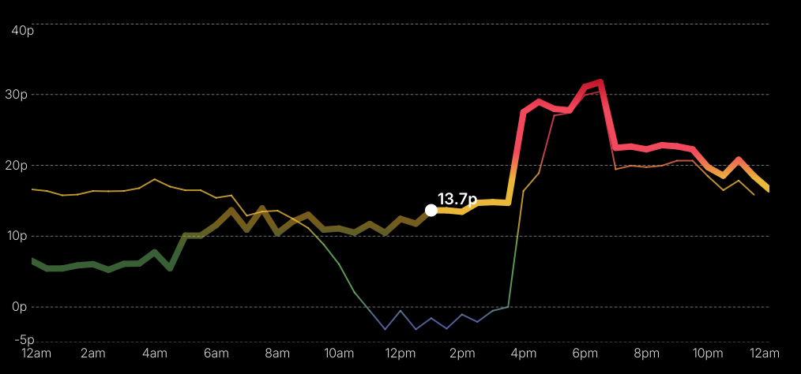

# Octograph Query

A Go web service for querying and visualising electricity pricing data from InfluxDB. 



**Note:** This service is designed to be run alongside the [Yanson/octograph](https://github.com/Yanson/octograph) which includes it in its Docker Compose setup.

## Features
- Query today's electricity pricing data for a given location
- Render a chart as a PNG image (with configurable size)
- View the chart in a simple HTML page for HiDPI displays
- Download the raw data as CSV

## Requirements
- Go 1.24+
- InfluxDB 2.x instance with relevant data from [Yanson/octograph](https://github.com/Yanson/octograph)

## Building Locally

1. Clone the repository:
   ```sh
   git clone <repo-url>
   cd octograph-query
   ```
2. Build the Go binary:
   ```sh
   go build -o octograph-query main.go
   ```

## Running Locally

1. Set the required environment variables (see below).
2. Start the server:
   ```sh
   ./octograph-query
   ```
3. Open your browser at [http://localhost:8080/data?location=YOUR_LOCATION&format=html](http://localhost:8080/data?location=YOUR_LOCATION&format=html)

## Running with Docker

Build and run the container:
```sh
docker build -t octograph-query .
docker run --rm -p 8080:8080 \
  -e INFLUXDB_TOKEN=your_token \
  -e INFLUXDB_URL=your_influx_url \
  -e INFLUXDB_ORG=your_org \
  -e INFLUXDB_BUCKET=your_bucket \
  octograph-query
```

## Environment Variables

| Variable          | Description              | Default                |
|-------------------|--------------------------|------------------------|
| `INFLUXDB_URL`    | InfluxDB server URL      | (required, no default) |
| `INFLUXDB_TOKEN`  | InfluxDB API token       | (required, no default) |
| `INFLUXDB_ORG`    | InfluxDB organization ID | (required, no default) |
| `INFLUXDB_BUCKET` | InfluxDB bucket name     | (required, no default) |
| `HTTP_PORT`       | Port for the HTTP server | 8080                   |

## Query Parameters

- `location` (required): The location to query.
- `format`: `png`, `html`, or `csv` (default: `html`).
- `width`, `height`: Chart image size in pixels (defaults: 720x338, sensible range: width 200–2000, height 100–1200).

## Example Usage

- HTML chart:  
  `http://localhost:8080/data?location=Home&format=html`
- PNG image:  
  `http://localhost:8080/data?location=Home&format=png&width=800&height=400`
- CSV export:  
  `http://localhost:8080/data?location=Home&format=csv`

## Monitoring and Readiness

### Prometheus Metrics

Metrics are available at the `/monitoring/metrics` endpoint in Prometheus format. Example:

```
http://localhost:8080/monitoring/metrics
```

Exposed metrics include:

- `http_requests_total`: Total HTTP requests processed, labeled by status code and method.
- `http_request_duration_seconds`: Duration of HTTP requests, labeled by handler and method.
- `octograph_query_requests_total`: Total number of `/query` requests, labeled by `format`.

You can scrape this endpoint with Prometheus or view metrics directly in your browser.

### Readiness Probe

A simple readiness endpoint is available at:

```
http://localhost:8080/monitoring/ping
```

This returns `pong` with HTTP 200 if the service is up.

## Disclaimer

> [!WARNING]  
> This project and its README were primarily generated by AI assistance. While efforts have been made to ensure accuracy, there may be errors or false information present. Please review and verify any critical details before use.
    

